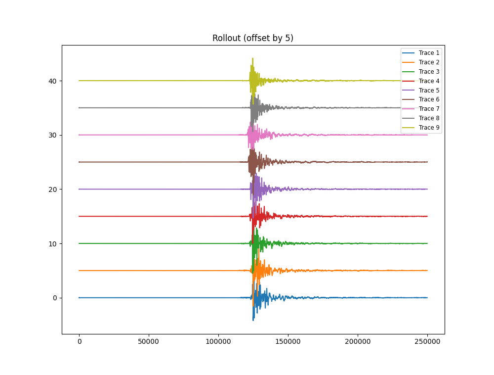
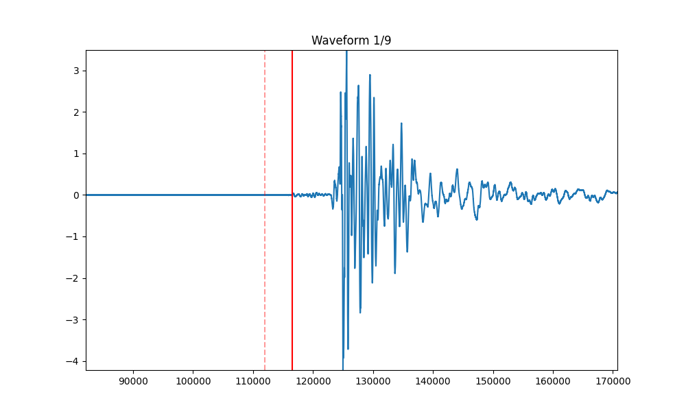

# Python Interactive UI for Manual Waveform Marking  
## University of Texas at Austin
Created by Isaac Xu and Dr. Chas Bolton
# Download instructions
Download python file and run requirements.txt 
# Overview
Created for marking p-wave arrivals for waveforms using manual user input, saves user clicked x axis positions as a separate csv file for further analysis. Also can visualize the rollout of an .mseed file, assuming separate channels are in the same .mseed file. 
# Manual User Input Scripts
manual_pwave_entry.py
 
Accepted waveform file formats are .mseed or a folder of .mseed
  
The script treats each trace in the stream as separate for marking, it takes in a folder or file of .mseed files and uses the structure of the folder for naming. The folder should be structured as 
data/experiment_name/run_num/.mseed_files_here for the automatic labeling to be accurate. 
 
### If a file is selected:
The output csv will be named p_picks_experiment name_run number_event id_trace#.csv 
 
### If a folder is selected:
The output csv will be named p_picks_folder name.csv
 
These csv files will be saved in the same directory as the python script, the output csv will have two columns: Name, and marked_point, the name will be "p_picks_Exp_num_Run_num_EventID_num_trace#" and marked_point is in a list (for multiple picks per trace) where the x axis was marked by the user

 
# Automatic Scripts 
Additionally this repo includes several scripts for automatic waveform marking, there are two: STA/LTA as well as noise. Noise reads the first 1000000 samples which creates a fence and marks the first deviation, LTA/STA is a signal processing method used to distinguish statistically significant events (i.e. jumps and deviations). 

